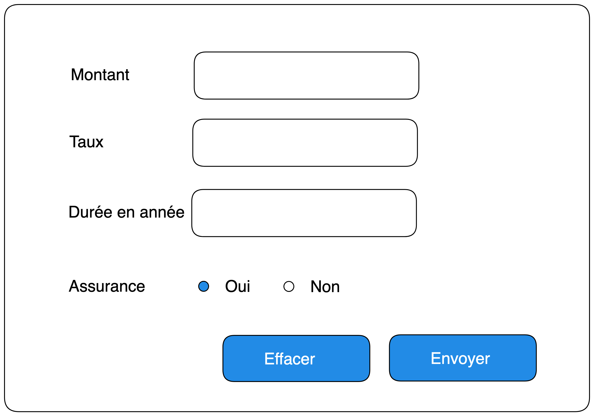

# Exercise 3

## Objective

- Create a real estate advertisement site offering a financing plan to visitors.
- Create a form to enter the data needed to calculate the loan.

## Statement

- Display the monthly payment excluding insurance as well as the amortization table containing, among other things, the remaining capital due and the interest for each period.

Formule de calcul des mensualités de prêt conso

    m = [C × (t/12)] / [1 – (1 + (t/12)^-(12 × n))]

Calculons la mensualité d'un crédit à remboursement constant de 100 000 euros au taux annuel proportionnel de 4% (le taux nominal que l'organisme de crédit nous donne), sur une durée de 20 ans soit 240 mois.

En appliquant la formule nous obtenons :

    [100000 × 0,04/12] / [1−(1+ (0,04/12))^-(12*20)] = 605,98€

remarque : dans la formule 4% devient 4/100 = 0,04

Cout total interet

    12*n*m-C

Si vous avez emprunté 100 000 € sur 20 ans, et que votre mensualité est de 605,98 €, le coût total en intérêts est de :

    12*20*605,98-100000 = 45440 €

Calculer les intérêt d’un prêt amortissable

1ère mensualité

    (100 000 € * 4 %) / 12 = 333,33 €

Calulons le capital retant du :

    605,98 -333,33 = 272,64 €
    
    100 000 - (605,98 -333,33) = 99727 (arrondis)
    
    Capital Retant du 99727 €

2ème mensualité

    (99727 € * 4 %) / 12 = 332,42 € 

En résumé

Prêt à taux fixe

- Somme totale empruntée : 100 000 €
- Taux d'intérêt : 4 %
- Durée de l'emprunt 240 mois

| Echeance | Intérets | Amortissement  | Le capital restant dû (CRD) | Mensualité |
|:--------:|:--------:|:--------------:|:---------------------------:|:----------:|
|    1     | 333,33 € |    272,64 €    |         99 727,00 €         |  605,98 €  |
|    2     | 332,42 € |    273,55 €    |         99 454,00 €         |  605,98 €  |
|    3     | 331,51 € |    274,46 €    |         99 179,00 €         |  605,98 €  |
|    ..    |    ..    |       ..       |             ..              |     ..     |
|   240    |  2,01 €  |    603,96 €    |             0 €             |  605,98 €  |

